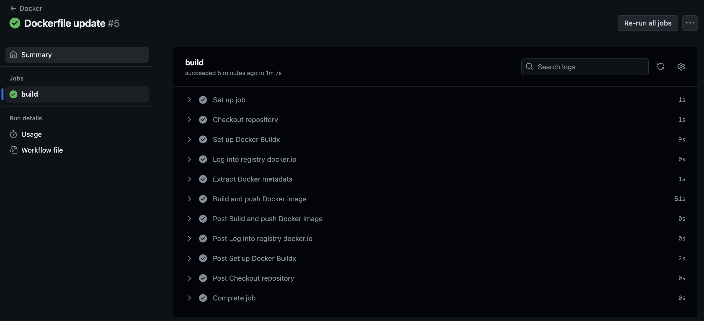

# Docker Actions pipeline to build and push into Docker Hub

## About:

Created a GitHub actions to automatically build a container using the Dockerfile in the root path, then test it and if all checks are passed, push it into Docker Hub using Secrets for store credentials.

## Proof:

